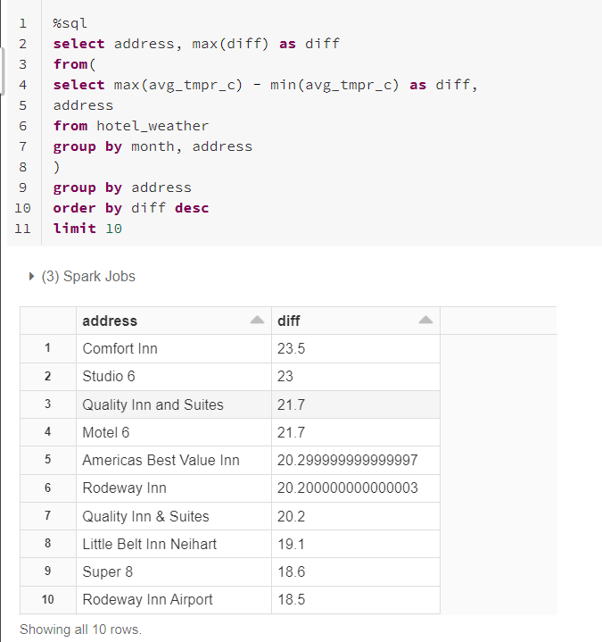
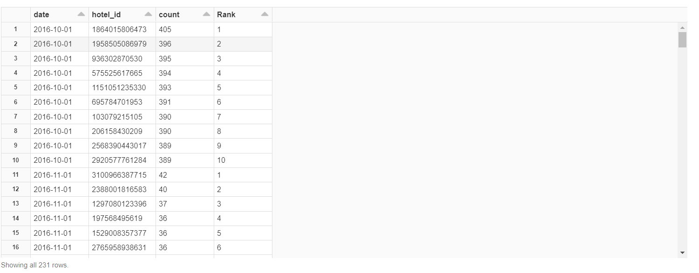
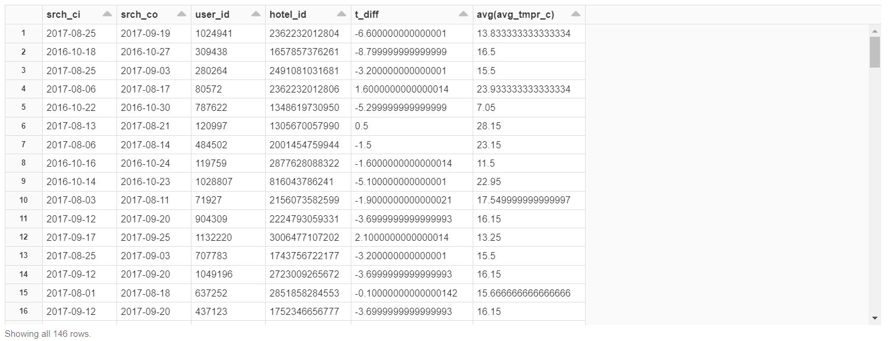

Top 10 hotels with max absolute temperature difference by month.

Top 10 busy (e.g., with the biggest visits count) hotels for each month. If visit dates refer to several months, it should be counted for all affected months.

For visits with extended stay (more than 7 days) calculate weather trend (the day temperature difference between last and first day of stay) and average temperature during stay.

